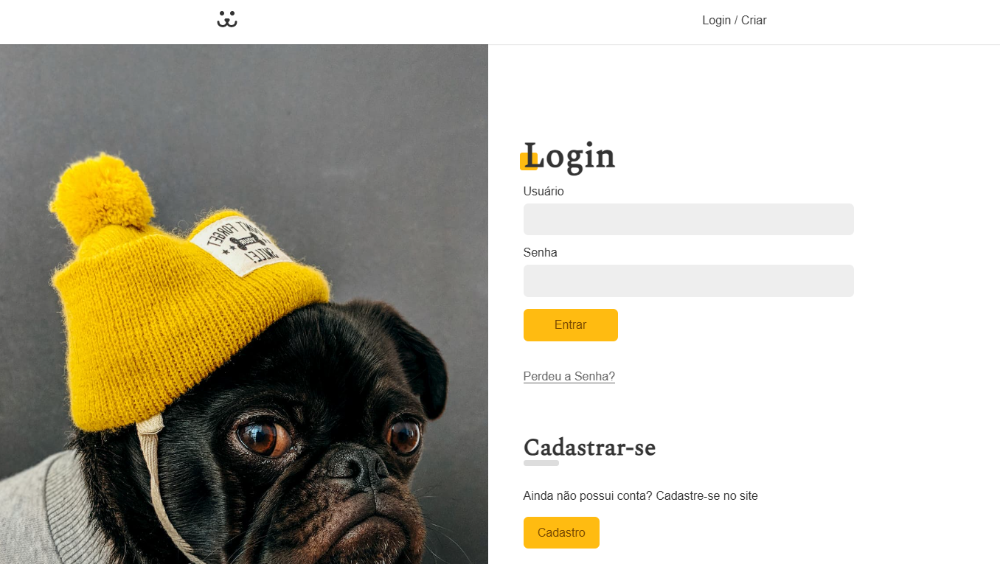

# 📌 Dogs

 

## 👤 Como interagir com o projeto

Acesse o [link do site hospedado na Vercel](https://dogs-wine.vercel.app/) 
É possível acessar com um usário padrão, ou criar o seu.\
Usuário padrão: dog
Senha: dog

* O site é construído a partir de uma API pública, dados não padrão adicionados são excluídos a cada 10 minutos.

 

## 🚀 Tecnologias utilizadas

* HTML 5
* CSS 3
* JavaScript
* Vite
* React
* React Router
* Victory

 

## 🎯 Funcionalidades

* [ ] Cadastro, login e logout de usuário
* [ ] Resetar senha
* [ ] Feed de fotos
* [ ] Postar uma foto
* [ ] Comentar nas fotos
* [ ] Analisar as estatísticas do perfil (acessos)

 

## 📸 Preview

 

## 🧠 Aprendizados

* React Hooks e Custom Hooks
* Manipulação de DOM
* Utilização de formulários
* Consumo de API
* Utilização de variáveis globais (createContext e useContext)
* Navegação - React Router
* CSS module
* Organização de código

 

## 🛠️ Melhorias futuras

* [ ] Testes automatizados
* [ ] TypeScript

 

## ⚙️ Features que eu adicionei

* [ ] Filtro para as fotos do Feed
* [ ] Busca de usuário
* [ ] Dark mode

 

## 🙋‍♀️ Autora

Feito por Andressa Tomiozzo no curso de React na Origamid. 
[LinkedIn](https://www.linkedin.com/in/andressa-tomiozzo/)
